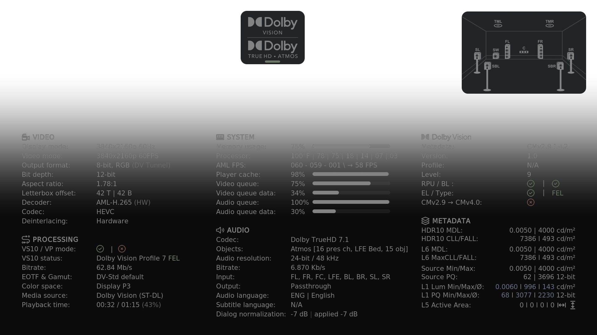
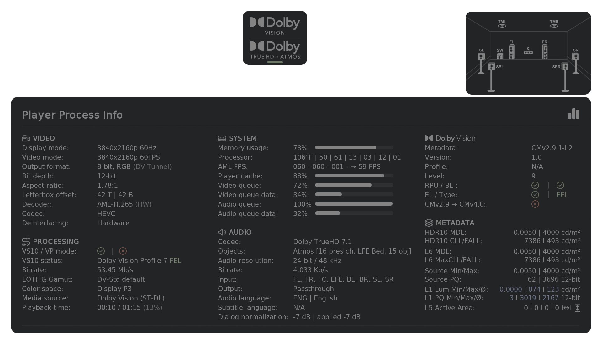
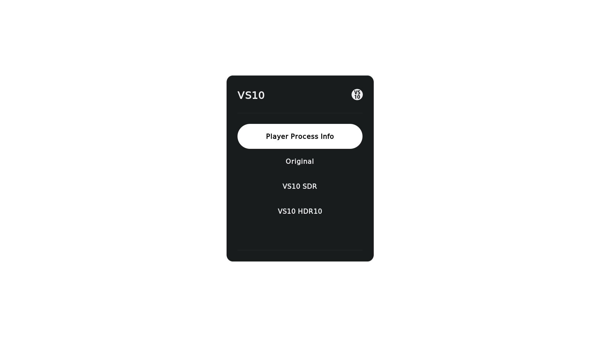

# signde PPI (avdvplus / p3i)

A CoreELEC 21 fork of Jamal's TinyPPI that displays detailed playback information in a custom overlay window during video playback. It provides real-time data on video, audio, HDR, Dolby Vision, system resources, and more — with special support for **Amlogic** hardware (e.g. CoreELEC devices).

Player Process Info can use either a full-screen **Classic** gradient or the rounded **Modern** dialog background. Classic is the default; both modes use the same information and layout.

The independent add-on ID, `script.signde.tinyppi`, allows this fork to be installed alongside the original TinyPPI without sharing its settings or runtime state.

---

## Screenshots
<p align="center">

</p>

<p align="center">

</p>

<p align="center">

</p>

---

## Installation

### Via Repository

1. Open **Settings → File Manager → Add Source**.
2. Enter the repository URL and confirm:
   ```
   https://signde.github.io/repository.signde/
   ```
3. Go to **Add-ons → Install from ZIP file** and select the source you just added.
4. Install the repository ZIP file.
5. Go to **Install from repository**, open the signde repository, select **signde PPI (avdvplus / p3i)** and install.

---

## Usage

> **IMPORTANT: If you use one of the modified skins from the signde repository, you do not need to configure a remote shortcut. Those skins already launch signde PPI from their Player Process Info controls. The shortcut instructions below are for other skins or custom launch behavior.**

### Assign a remote shortcut — Easy way (Keymap Editor)

1. Install the **Keymap Editor** addon.
2. Open it and select **Edit → Global → Add-ons**.
3. Select **Launch signde PPI**.
4. Press the key or button you want to assign, then confirm.
5. Go back and select **Save**.

Pressing the assigned key/button will now launch or close signde PPI in the Video OSD.

### Assign a remote shortcut — Manual (`gen.xml`)

Place the following in `Userdata/keymaps/gen.xml`, replacing `xxxxx` with your key name:

```xml
<keymap>
  <global>
    <keyboard>
      <xxxxx>RunAddon(script.signde.tinyppi)</xxxxx>
    </keyboard>
  </global>
</keymap>
```

### Launch from another addon or autostart (Python)

```python
import xbmc
xbmc.executebuiltin('RunScript(script.signde.tinyppi)')
```

### Launch via Kodi URL

```
plugin://script.signde.tinyppi/
```

---

## Codec Logos

signde PPI can display the current **video (HDR) and audio format** as stacked logos
directly on the video window during playback. The video/HDR logo sits on top, the
audio logo below it, on a rounded panel whose colors and opacity are fully themeable
in the add-on settings. The logos are re-resolved live, so switching the audio track
updates the audio logo on the fly.

You can enable the logos in three independent situations (**Settings → Codec Logos**):

- **On playback start** — shown for the first few seconds after a video starts
  (duration configurable).
- **While the Video OSD is open** — shown whenever the player OSD is visible.
- **While the signde PPI overlay is open** — shown alongside the info overlay.

For each situation the horizontal/vertical position and the size can be adjusted
separately.

Each situation also has a **Dolby Vision indicator position** setting:
**Bottom** places the FEL/MEL/other DV pill below the audio logo;
**Top** (the default) places it above the video logo. For Dolby Vision badges, both ends of
the panel reserve equal padding, giving the pill matching clearance from the
logo and outer edge. Switching positions keeps the same panel size and
video-above-audio order.

### Supported formats

**Video / HDR**

| Logo | Format |
|------|--------|
| SDR | Standard Dynamic Range |
| HDR10 | HDR10 |
| HDR10+ | HDR10+ |
| HLG | Hybrid Log-Gamma |
| Dolby Vision | Dolby Vision |

**Audio**

| Logo | Format |
|------|--------|
| AAC | AAC (incl. HE-AAC) |
| Dolby Digital | Dolby Digital (AC-3) |
| Dolby Digital Plus | Dolby Digital Plus (E-AC-3) |
| Dolby Digital Plus Atmos | Dolby Digital Plus with Dolby Atmos |
| Dolby TrueHD | Dolby TrueHD |
| Dolby TrueHD Atmos | Dolby TrueHD with Dolby Atmos |
| DTS | DTS |
| DTS 96/24 | DTS 96/24 |
| DTS-ES | DTS-ES |
| DTS-Express | DTS Express |
| DTS-HD HRA | DTS-HD High Resolution Audio |
| DTS-HD MA | DTS-HD Master Audio |
| DTS:X | DTS:X |
| IMAX | DTS:X IMAX Enhanced |
| FLAC | FLAC |
| PCM | PCM / LPCM |
| MP3 | MP3 |
| OPUS | Opus |
| Vorbis | Vorbis / Ogg Vorbis |

Formats without a matching logo simply omit the audio image.
Codec variants are selected from Kodi's active-player codec label. For example,
DTS-ES receives its dedicated badge when Kodi reports `dts_es`; a stream Kodi's
FFmpeg layer exposes only as `dts` receives the standard DTS badge.

---

## Channel Layout Graphic

signde PPI can display a **speaker layout graphic** for the current audio track,
visualising how many channels the stream carries and where the active speakers
sit. The active speakers are highlighted against the full layout, so a 5.1 track
lights up its six positions while the remaining speaker slots stay dimmed.

The graphic can be enabled independently per output type
(**Settings → Channels**):

- **Channels in SDR** — show the layout while playing SDR content.
- **Channels in HDR10 / HLG / HDR10+** — show the layout while playing HDR content.
- **Channels in Dolby Vision** — show the layout while playing Dolby Vision content
  (drawn in its own panel above the main info box).

The colors of the background box, the speaker layout behind the active channels,
and the active channels themselves are all fully themeable in the add-on settings.

### Supported layouts

| Graphic | Layout |
|---------|--------|
| 1.0 | Mono |
| 2.0 | Stereo |
| 2.1 | Stereo + LFE |
| 3.1 | 3.1 surround |
| 4.1 | 4.1 surround |
| 5.1 | 5.1 surround |
| 5.1.2 | 5.1.2 with height channels (Atmos / DTS:X) |
| 6.1 | 6.1 surround |
| 7.1 | 7.1 surround |
| 7.1.2 | 7.1.2 with height channels (Atmos / DTS:X) |

The height variants (5.1.2 / 7.1.2) are selected automatically for Dolby Atmos
and DTS:X streams — Kodi reports only a channel count, so the extra height
channels are inferred from the codec. Channel counts without a matching graphic
simply omit the image.

---

## Advanced Launch Arguments

signde PPI supports additional arguments to open specific modes or apply VS10 output modes directly — without opening the overlay or the dialog first.

### Open the VS10 mode selection dialog

```
RunScript(script.signde.tinyppi,dialog)
```

Opens the VS10 mode selection dialog instead of the main signde PPI overlay.
It shows the modes that apply to the playing source; on an **HDR10+** or
an **HLG** stream — neither of which is a VS10 input — it draws no modes at
all and leaves the player-process button on its own.

### Apply a VS10 output mode directly

Use `run_mode` followed by the mode name to switch the VS10 output mode immediately. This is useful for keymap shortcuts or automation from other addons.

```
RunScript(script.signde.tinyppi,run_mode,sdr8)
RunScript(script.signde.tinyppi,run_mode,sdr10)
RunScript(script.signde.tinyppi,run_mode,hdr10)
RunScript(script.signde.tinyppi,run_mode,dv)
RunScript(script.signde.tinyppi,run_mode,original_sdr)
RunScript(script.signde.tinyppi,run_mode,original_hdr)
RunScript(script.signde.tinyppi,run_mode,original_dv)
```

| Mode | Description |
|------|-------------|
| `original_sdr` | Pass through SDR content unchanged |
| `original_hdr` | Pass through HDR10 content unchanged |
| `original_dv` | Pass through Dolby Vision content unchanged |
| `hdr10` | Convert to HDR10 output |
| `dv` | Convert to Dolby Vision output |
| `sdr8` | Convert to SDR 8-bit output |
| `sdr10` | Convert to SDR 10-bit output |

#### Example: keymap shortcut for a direct mode switch

```xml
<keymap>
  <global>
    <keyboard>
      <xxxxx>RunScript(script.signde.tinyppi,run_mode,hdr10)</xxxxx>
    </keyboard>
  </global>
</keymap>
```

#### Example: trigger from another addon (Python)

```python
import xbmc
xbmc.executebuiltin('RunScript(script.signde.tinyppi,run_mode,dv)')
```

---

## Credits

signde PPI is a fork of [TinyPPI](https://github.com/CE-Repo/script.tinyppi) and builds on the following work:

- **Jamal (jamal2362)** — original TinyPPI author, design, features, and assets. See the [original TinyPPI discussion](https://discourse.coreelec.org/t/tinyppi-universal-playerprocessinfo-for-ce-22/58995).
- **avdvplus** — initial CoreELEC 21 compatibility port and integration work.

TinyPPI is the foundation of this add-on. Many thanks to its authors and contributors.
